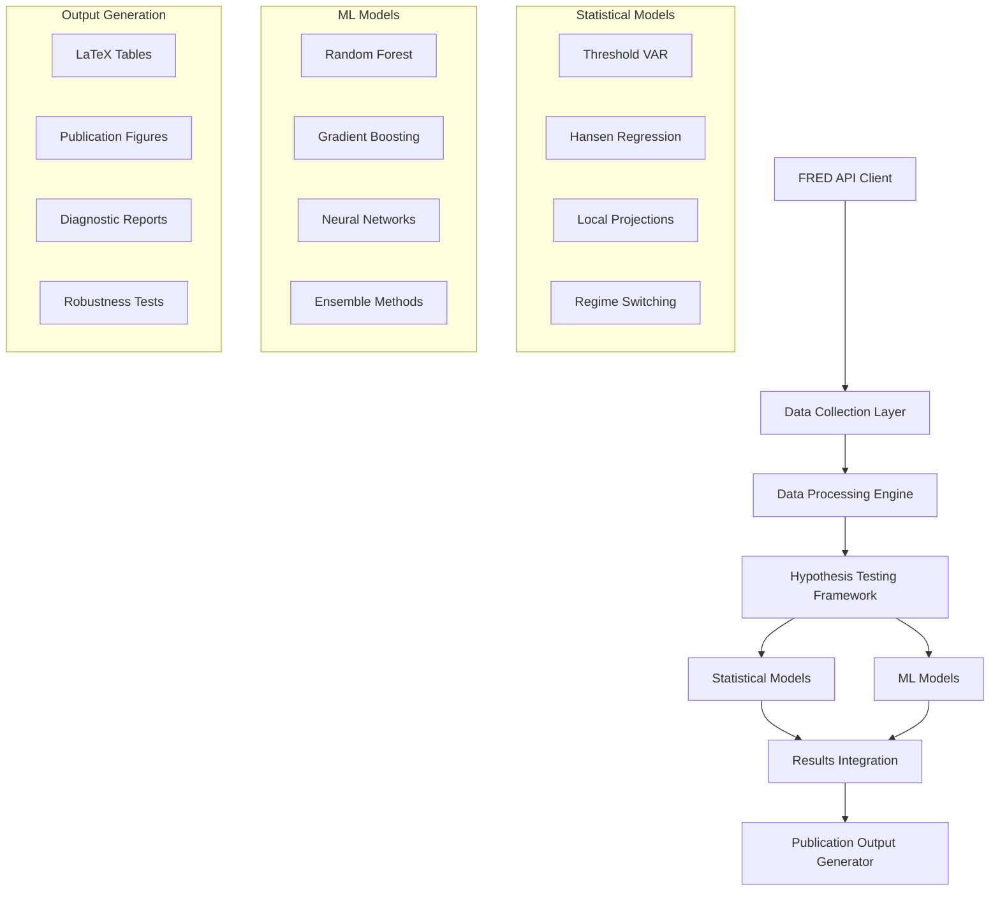

# Design Document

## Overview

This design outlines a comprehensive hypothesis testing framework for three specific quantitative easing (QE) hypotheses using FRED API data integration, statistical models, and machine learning approaches. The system extends the existing QEIR codebase to provide robust econometric analysis with automated data collection, advanced modeling capabilities, and publication-ready outputs.

The framework tests:
1. **Threshold Effects**: Central bank reaction strength vs confidence effects creating yield reversal thresholds
2. **Investment Distortions**: QE intensity reducing private investment when market distortions dominate
3. **International Spillovers**: QE reducing foreign bond demand, causing currency depreciation and inflation

## Architecture

### High-Level Architecture



### Component Integration

The framework integrates with existing QEIR components:
- **Core Models**: Extends `HansenThresholdRegression`, `LocalProjections`
- **Analysis Modules**: Builds on `RevisedQEAnalyzer`, `InternationalAnalyzer`
- **Data Collection**: Enhances `FREDDataCollector` with hypothesis-specific series
- **Visualization**: Extends `PublicationVisualizationSuite` for hypothesis-specific outputs

## Components and Interfaces

### 1. FRED API Integration Layer

**Class**: `HypothesisDataCollector`
- **Purpose**: Automated collection of hypothesis-specific economic indicators
- **Key Methods**:
  - `collect_hypothesis1_data()`: Central bank reaction, confidence, debt service, yields
  - `collect_hypothesis2_data()`: Investment measures, QE intensity, market distortion proxies
  - `collect_hypothesis3_data()`: Foreign holdings, exchange rates, inflation indicators
  - `validate_data_quality()`: Data completeness and consistency checks

**Interface**:
```python
class HypothesisDataCollector:
    def __init__(self, fred_api_key: str)
    def collect_hypothesis1_data(self, start_date: str, end_date: str) -> Dict[str, pd.Series]
    def collect_hypothesis2_data(self, start_date: str, end_date: str) -> Dict[str, pd.Series]
    def collect_hypothesis3_data(self, start_date: str, end_date: str) -> Dict[str, pd.Series]
    def validate_data_quality(self, data: Dict[str, pd.Series]) -> Dict[str, Any]
```

### 2. Hypothesis Testing Framework

**Class**: `QEHypothesisTester`
- **Purpose**: Coordinates testing of all three hypotheses using multiple methodologies
- **Key Methods**:
  - `test_hypothesis1()`: Threshold effects analysis
  - `test_hypothesis2()`: Investment distortion analysis  
  - `test_hypothesis3()`: International spillover analysis
  - `run_robustness_tests()`: Cross-validation and sensitivity analysis

**Interface**:
```python
class QEHypothesisTester:
    def __init__(self, data_collector: HypothesisDataCollector)
    def test_hypothesis1(self, data: pd.DataFrame) -> Dict[str, Any]
    def test_hypothesis2(self, data: pd.DataFrame) -> Dict[str, Any]
    def test_hypothesis3(self, data: pd.DataFrame) -> Dict[str, Any]
    def run_robustness_tests(self, results: Dict[str, Any]) -> Dict[str, Any]
```

### 3. Statistical Models Extension

**Enhanced Hansen Threshold Model**:
- **Purpose**: Detect threshold where γ₁ (central bank reaction) and λ₂ (confidence effects) create yield reversals
- **Extensions**: Bootstrap confidence intervals, regime-specific diagnostics, alternative threshold methods

**Enhanced Local Projections**:
- **Purpose**: Trace dynamic effects of QE intensity on private investment
- **Extensions**: ML-enhanced impulse responses, non-linear projections, uncertainty quantification

**Regime-Switching VAR**:
- **Purpose**: Model switching between QE effectiveness regimes
- **Features**: Markov-switching parameters, regime probability estimation, transition analysis

### 4. Machine Learning Models

**Random Forest Regressor**:
- **Purpose**: Non-parametric threshold detection and variable importance ranking
- **Features**: Feature importance analysis, partial dependence plots, interaction detection

**Gradient Boosting**:
- **Purpose**: Capture complex non-linear relationships in QE transmission
- **Features**: SHAP value analysis, learning curve diagnostics, hyperparameter optimization

**Neural Network Ensemble**:
- **Purpose**: Deep learning approach to QE effect modeling
- **Features**: Attention mechanisms for time series, uncertainty estimation, interpretability layers

### 5. Results Integration Engine

**Class**: `HypothesisResultsIntegrator`
- **Purpose**: Combine statistical and ML results with uncertainty quantification
- **Key Methods**:
  - `integrate_threshold_results()`: Combine Hansen, RF, and NN threshold estimates
  - `integrate_investment_results()`: Merge statistical and ML investment impact estimates
  - `integrate_spillover_results()`: Synthesize international transmission findings
  - `generate_ensemble_predictions()`: Weighted combination of all models

## Data Models

### Core Data Structures

**HypothesisData**:
```python
@dataclass
class HypothesisData:
    # Hypothesis 1: Threshold Effects
    central_bank_reaction: pd.Series  # γ₁ proxy
    confidence_effects: pd.Series     # λ₂ proxy  
    debt_service_burden: pd.Series    # Debt service/GDP
    long_term_yields: pd.Series       # 10Y Treasury yields
    
    # Hypothesis 2: Investment Effects
    qe_intensity: pd.Series           # CB holdings/total outstanding
    private_investment: pd.Series     # Private fixed investment
    market_distortions: pd.Series     # μ₂ proxy (bid-ask spreads, etc.)
    interest_rate_channel: pd.Series  # Policy rate transmission
    
    # Hypothesis 3: International Effects
    foreign_bond_holdings: pd.Series  # Foreign holdings of domestic bonds
    exchange_rate: pd.Series          # Trade-weighted exchange rate
    inflation_measures: pd.Series     # CPI, PCE, import prices
    capital_flows: pd.Series          # International capital flows
    
    # Common variables
    dates: pd.DatetimeIndex
    metadata: Dict[str, Any]
```

**ModelResults**:
```python
@dataclass
class ModelResults:
    # Statistical model results
    hansen_results: Dict[str, Any]
    local_projections_results: Dict[str, Any]
    var_results: Dict[str, Any]
    
    # ML model results
    random_forest_results: Dict[str, Any]
    gradient_boosting_results: Dict[str, Any]
    neural_network_results: Dict[str, Any]
    
    # Integrated results
    ensemble_predictions: pd.DataFrame
    confidence_intervals: pd.DataFrame
    feature_importance: pd.DataFrame
    
    # Diagnostics
    model_diagnostics: Dict[str, Any]
    robustness_tests: Dict[str, Any]
```

### FRED API Data Mapping

**Hypothesis 1 Variables**:
- Central Bank Reaction (γ₁): FOMC meeting frequency, policy rate changes, balance sheet growth
- Confidence Effects (λ₂): Consumer confidence, business confidence, financial stress indices
- Debt Service Burden: Federal interest payments/GDP, debt service coverage ratios
- Long-term Yields: 10Y Treasury constant maturity, term premium estimates

**Hypothesis 2 Variables**:
- QE Intensity: Fed holdings/total outstanding Treasuries, MBS holdings
- Private Investment: Private fixed investment, equipment investment, structures investment
- Market Distortions (μ₂): Bid-ask spreads, market liquidity measures, volatility indices
- Interest Rate Channel: Federal funds rate, mortgage rates, corporate bond yields

**Hypothesis 3 Variables**:
- Foreign Holdings: TIC data on foreign Treasury holdings by country
- Exchange Rates: DXY, bilateral rates with major trading partners
- Inflation: CPI, PCE, import price indices, breakeven inflation rates
- Capital Flows: Portfolio flows, direct investment flows, reserve changes

## Error Handling

### Data Collection Error Handling

**Missing Data Strategy**:
- **Primary**: Use FRED API with automatic retry mechanisms
- **Secondary**: Fallback to alternative data sources (Yahoo Finance, ECB, etc.)
- **Tertiary**: Interpolation methods for short gaps, exclusion for long gaps

**API Rate Limiting**:
- Implement exponential backoff for API calls
- Queue management for large data requests
- Caching mechanisms to minimize repeated calls

**Data Quality Validation**:
- Outlier detection using statistical methods (IQR, Z-score)
- Consistency checks across related series
- Temporal alignment validation

### Model Error Handling

**Statistical Model Failures**:
- Alternative estimation methods (robust regression, LAD)
- Bootstrap procedures for failed asymptotic inference
- Model selection criteria for specification issues

**ML Model Failures**:
- Cross-validation for hyperparameter robustness
- Ensemble methods to reduce single-model risk
- Feature selection to handle multicollinearity

**Integration Failures**:
- Weighted averaging when models disagree significantly
- Uncertainty propagation through model combinations
- Sensitivity analysis for key assumptions

## Testing Strategy

### Unit Testing

**Data Collection Tests**:
- Mock FRED API responses for consistent testing
- Data validation function testing
- Error handling pathway verification

**Model Implementation Tests**:
- Statistical model accuracy against known benchmarks
- ML model reproducibility with fixed random seeds
- Integration logic correctness

**Output Generation Tests**:
- LaTeX table formatting validation
- Figure generation consistency
- File I/O operations

### Integration Testing

**End-to-End Pipeline Tests**:
- Complete hypothesis testing workflow
- Data flow through all components
- Results consistency across runs

**Cross-Model Validation**:
- Statistical vs ML model agreement
- Ensemble prediction accuracy
- Robustness across different data periods

### Performance Testing

**Computational Efficiency**:
- Large dataset processing benchmarks
- Memory usage optimization
- Parallel processing effectiveness

**API Performance**:
- FRED API response time monitoring
- Rate limiting compliance
- Data retrieval success rates

### Validation Testing

**Economic Validation**:
- Results consistency with economic theory
- Comparison with existing literature findings
- Expert review of methodology and results

**Statistical Validation**:
- Model assumption testing
- Diagnostic test interpretation
- Robustness check comprehensiveness

## Implementation Phases

### Phase 1: Data Infrastructure (Tasks 1-3)
- FRED API integration and data collection
- Data processing and validation pipelines
- Basic statistical model implementation

### Phase 2: Core Hypothesis Testing (Tasks 4-8)
- Hypothesis 1: Threshold effects implementation
- Hypothesis 2: Investment distortion analysis
- Hypothesis 3: International spillover testing

### Phase 3: Advanced Modeling (Tasks 9-12)
- Machine learning model integration
- Ensemble method development
- Advanced diagnostics and robustness testing

### Phase 4: Output Generation (Tasks 13-15)
- Publication-ready visualization system
- LaTeX table generation
- Comprehensive reporting framework

This design provides a robust foundation for implementing the QE hypothesis testing framework while maintaining integration with the existing QEIR codebase and ensuring publication-quality outputs.